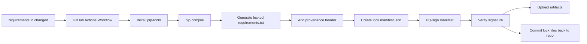
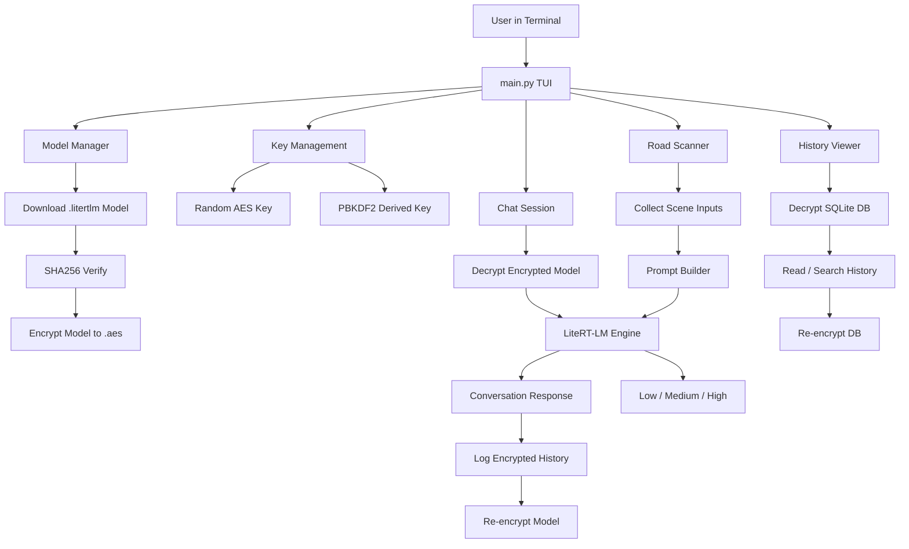
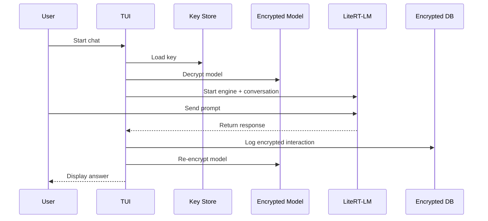

# Humoid-Gui-Gemma

Encrypted local AI CLI/TUI built around **LiteRT-LM** and a local **Gemma** LiteRT-LM model.

Humoid-Gui-Gemma is a terminal-first app focused on:

- encrypted local model storage
- encrypted chat history
- interactive TUI workflows
- local inferencing through `litert-lm`
- optional road-risk classification flow
- repeatable dependency locking with GitHub Actions
- post-quantum signing for generated lock artifacts

---

## What it does

Humoid-Gui-Gemma downloads a LiteRT-LM model, verifies its SHA256 checksum, encrypts it at rest, decrypts it only when needed, runs inference locally, then re-encrypts the model after use.

It also stores chat history in an encrypted SQLite database and provides menu-driven flows for:

- model management
- chatting with the model
- road scanner classification
- browsing encrypted chat history
- rotating encryption keys

---

## Core features

### Secure model handling

- downloads a model from a configured repository
- verifies the downloaded file against an expected SHA256 hash
- encrypts the model with AES-GCM
- removes plaintext model files after use

### Encrypted chat history

- stores interactions in SQLite
- encrypts the database file on disk
- decrypts only for read/write operations

### LiteRT-LM runtime

- uses `litert-lm` instead of `llama-cpp-python`
- targets a LiteRT-LM model artifact such as:
  - `litert-community/gemma-4-E2B-it-litert-lm`
- uses the LiteRT-LM conversation engine for prompting and responses

### TUI workflow

- keyboard-driven terminal menu
- model manager
- interactive chat session
- road scanner workflow
- history viewer
- key rotation flow

### Supply-chain locking

- `requirements.in` is the human-maintained dependency source
- GitHub Actions compiles a fully pinned `requirements.txt`
- lock artifacts are signed and uploaded
- generated lock outputs can be committed back to the repository

---

## Repository layout

```text
.
├── main.py
├── requirements.in
├── requirements.txt
├── install_ubuntu_humoid_gui_gemma_4.sh
├── install_termux_humoid_gui_gemma_4.sh
├── models/
├── .github/
│   └── workflows/
│       └── lock-and-pq-sign-lockfile.yml
└── README.md
```

---

## How it works

### 1. Key management

On first run, the app creates or derives an encryption key.

It supports:

- random AES key generation
- passphrase-derived key generation with PBKDF2

### 2. Model download and verification

The configured model file is downloaded and checked against `EXPECTED_HASH`.

If the checksum does not match, the workflow stops unless the operator explicitly keeps the file.

### 3. Model encryption at rest

The plaintext model is encrypted to `*.aes` using AES-GCM.

The plaintext copy can then be removed.

### 4. Runtime inference

When a chat or scan session starts:

1. the encrypted model is decrypted temporarily
2. LiteRT-LM loads the `.litertlm` model
3. the conversation runs locally
4. the model is unloaded
5. the plaintext model is re-encrypted and deleted

### 5. Encrypted history logging

Prompts and responses are saved into an encrypted SQLite database.

---

## Installation

This section combines the previous install guide into the main README.

### Requirements

#### Python dependencies

The project uses a pinned `requirements.in` that is compiled into a locked `requirements.txt`.

Current direct dependencies:

```text
litert-lm==0.10.1
httpx==0.28.0
aiosqlite==0.21.0
cryptography==46.0.1
psutil==6.1.1
pennylane==0.41.0
```

#### Model format

This project is intended to use a LiteRT-LM model file:

- `.litertlm`

Example target:

- `litert-community/gemma-4-E2B-it-litert-lm`

### Ubuntu / Debian install

Use this installer:

```bash
#!/usr/bin/env bash
set -euo pipefail

APP_DIR="$HOME/humoid-gui-gemma-4"
VENV_DIR="$APP_DIR/venv"
REPO_URL="https://github.com/ornab74/humoid-gui-gemma-4.git"

echo "Updating system packages..."
sudo apt update
sudo apt upgrade -y

echo "Installing required packages..."
sudo apt install -y \
    git \
    curl \
    wget \
    nano \
    python3 \
    python3-pip \
    python3-venv

echo "Cloning or updating Humoid-Gui-Gemma-4 repo..."
mkdir -p "$APP_DIR"

if [ -d "$APP_DIR/.git" ]; then
    git -C "$APP_DIR" pull --ff-only
else
    git clone "$REPO_URL" "$APP_DIR"
fi

echo "Creating Python virtual environment..."
python3 -m venv "$VENV_DIR"

# shellcheck disable=SC1091
source "$VENV_DIR/bin/activate"
python -m pip install --upgrade pip

if [ -f "$APP_DIR/requirements.txt" ]; then
    pip install -r "$APP_DIR/requirements.txt"
elif [ -f "$APP_DIR/requirements.in" ]; then
    pip install -r "$APP_DIR/requirements.in"
fi

chmod +x "$APP_DIR/main.py" 2>/dev/null || true

echo
echo "Setup complete."
echo "Run with:"
echo "cd \"$APP_DIR\""
echo "source venv/bin/activate"
echo "python -u main.py"
```

### Manual Ubuntu install

```bash
sudo apt update
sudo apt install -y git python3 python3-pip python3-venv curl wget nano

git clone https://github.com/ornab74/humoid-gui-gemma-4.git
cd humoid-gui-gemma-4
python3 -m venv venv
source venv/bin/activate
python -m pip install --upgrade pip
pip install -r requirements.txt
python -u main.py
```

### Termux + Ubuntu proot install

Use this when running through Termux.

```bash
#!/data/data/com.termux/files/usr/bin/bash
set -e

echo "Updating Termux packages..."
pkg update -y && pkg upgrade -y
pkg install -y bash bzip2 coreutils curl file findutils gawk gzip ncurses-utils proot sed tar util-linux xz-utils git wget

echo "Removing any old proot-distro..."
proot-distro remove ubuntu 2>/dev/null || true
rm -rf $HOME/proot-distro 2>/dev/null

echo "Cloning old working proot-distro commit..."
cd $HOME
git clone https://github.com/termux/proot-distro.git
cd proot-distro
git checkout ca53fee288be8f46ee0e4fc8ee23934023472054

echo "Installing proot-distro from this commit..."
chmod +x install.sh
./install.sh

echo "Installing Ubuntu rootfs..."
proot-distro install ubuntu

echo "Creating TMP dir..."
export PROOT_TMP_DIR=$HOME/tmp
mkdir -p $PROOT_TMP_DIR

echo "Setting up sudouser + Python + Naza repo..."
proot-distro login ubuntu -- <<'EOU'
apt update && apt upgrade -y
apt install -y sudo python3 python3-pip python3-venv git nano curl

adduser --disabled-password --gecos "" sudouser
usermod -aG sudo sudouser
echo "sudouser ALL=(ALL) NOPASSWD:ALL" >> /etc/sudoers

su - sudouser -c "
    mkdir -p ~/humoid-gui-gemma-4 && cd ~/humoid-gui-gemma-4
    git clone https://github.com/ornab74/humoid-gui-gemma-4.git . || git pull
    python3 -m venv venv
    source venv/bin/activate
    pip install --upgrade pip
    [ -f requirements.txt ] && pip install -r requirements.txt || true
    chmod +x main.py
"

echo "Setup complete inside Ubuntu"
EOU
```

### Termux auto-start banner

```bash
cat > ~/.bashrc <<'BASHRC'
if [ -z "$NAZA_STARTED" ] && [ "$PWD" = "$HOME" ] && [ -z "$SSH_CLIENT" ] && [ -z "$TMUX" ]; then
    export NAZA_STARTED=1

    echo ""
    echo "╔══════════════════════════════════════════════════════════╗"
    echo "║          Starting SecureLLM TUI (humoid-gui-gemma-4/main.py)           ║"
    echo "║        Ubuntu proot → /home/sudouser/humoid-gui-gemma-4                ║"
    echo "╚══════════════════════════════════════════════════════════╝"
    echo "   Type 'exit' twice to return to Termux"
    echo ""

    proot-distro login ubuntu --user sudouser --shared-tmp -- bash -c "
        cd /home/sudouser/humoid-gui-gemma-4 || exit 1
        source venv/bin/activate || exit 1
        export TERM=xterm-256color
        export LANG=C.UTF-8
        export PYTHONUNBUFFERED=1
        clear
        echo 'Starting main.py in venv...'
        exec python -u main.py
    "

    clear
    echo "Returned to Termux."
fi
BASHRC

echo "alias humoid='proot-distro login ubuntu --user sudouser -- bash -c \"cd ~/humoid-gui-gemma-4 && source venv/bin/activate && python -u main.py\"'" >> ~/.bashrc
```

---

## Running the app

From the project root:

```bash
source venv/bin/activate
python -u main.py
```

Expected menu areas:

- Model Manager
- Chat with model
- Road Scanner
- View chat history
- Rekey / Rotate key

---

## First run checklist

1. Start the application.
2. Create or derive an encryption key.
3. Download the configured LiteRT-LM model.
4. Verify SHA256.
5. Encrypt the model.
6. Run chat or road scanner.

---

## GitHub Actions lock pipeline

The repository can generate a locked dependency set from `requirements.in`.

### Pipeline responsibilities

- compile `requirements.txt` from `requirements.in`
- include hashes in the generated lock file
- record provenance metadata
- create a canonical lock manifest
- PQ-sign the manifest
- verify the signature
- upload the lock artifacts
- optionally commit generated lock files back to the repository

### Workflow diagram



### Architecture diagram



### Example runtime flow



---

## Dependency locking

`requirements.in` is the source file used by the lock workflow.

A GitHub Actions workflow can:

- compile `requirements.txt`
- add hashes
- add a provenance header
- generate a canonical manifest
- sign the manifest
- upload artifacts
- commit lock outputs back into the repository

---

## Configuration points

Common values you may change in `main.py`:

- `MODEL_REPO`
- `MODEL_FILE`
- `EXPECTED_HASH`
- `MODELS_DIR`
- `DB_PATH`
- `KEY_PATH`

---
