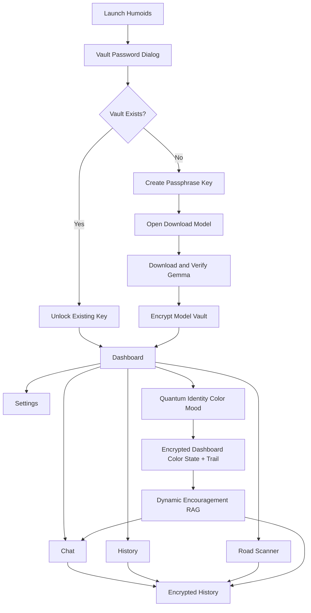
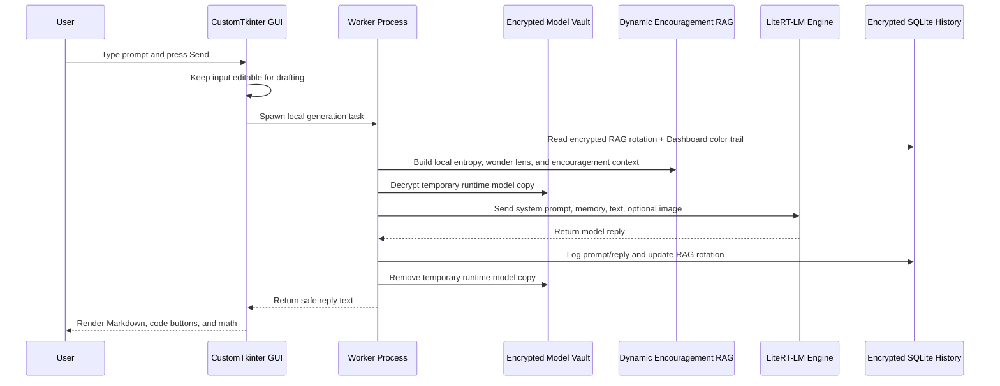
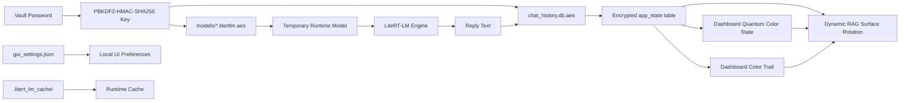
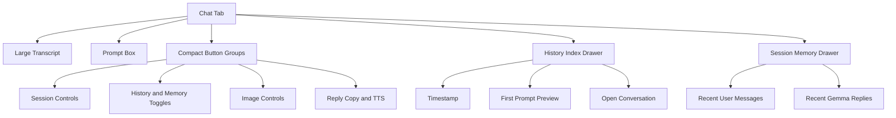
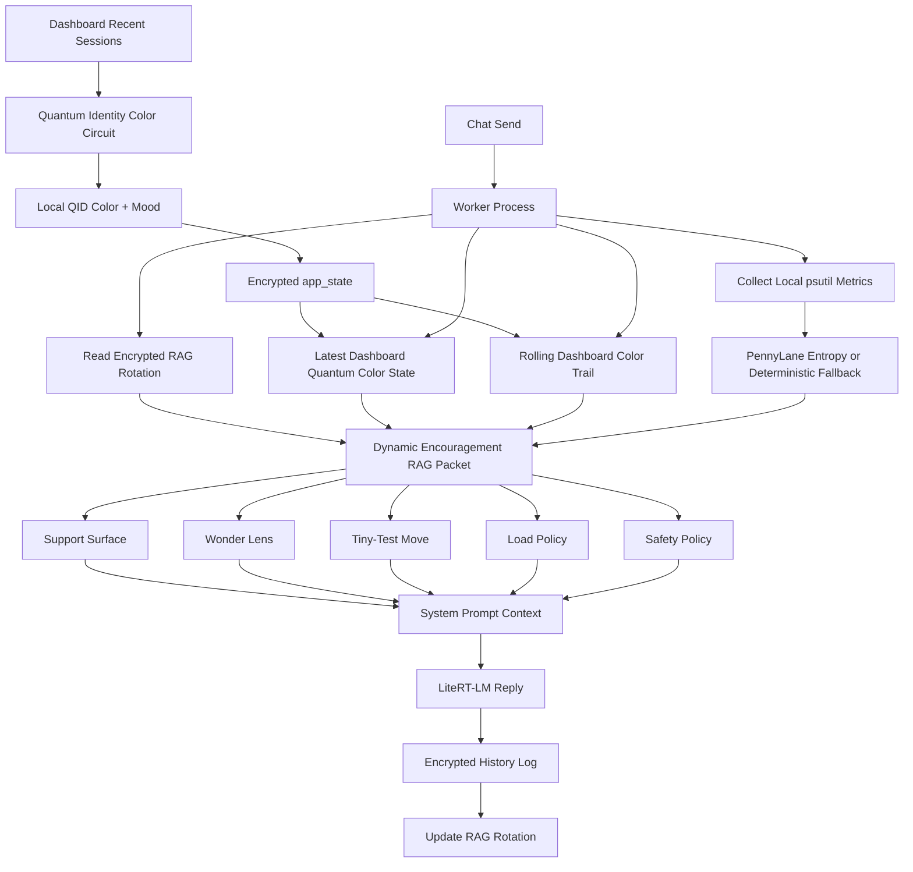

# Humoids

Private local AI desktop app for running a Gemma LiteRT-LM model with an encrypted model vault, encrypted chat history, a polished CustomTkinter UI, local-first workflows, and a dynamic Encouragement RAG layer.

Humoids is built around a simple normal-user flow:

1. Create or enter a vault password.
2. Download and encrypt the configured Gemma model from the `Download Model` tab.
3. Chat locally with Dynamic Support RAG, browse saved conversations, or run the Road Scanner.
4. Keep local model files, settings, and encrypted history under your control.

## Screenshots


## Current App Flow



## What It Does

- Runs a local Gemma LiteRT-LM model through `litert-lm`.
- Stores the model encrypted at rest as `models/*.litertlm.aes`.
- Uses a temporary runtime model copy only when the model needs to run.
- Stores chat and Road Scanner history in an encrypted SQLite database.
- Provides a dashboard with recent conversation cards, a Quantum Identity color signal, and a locally generated mood label.
- Stores the latest dashboard Quantum Color state and a short color trail in encrypted app state.
- Uses Dynamic Support / Encouragement RAG to add local-only encouragement, first-principles wonder lenses, tiny-test prompts, and anti-repetition rotation to chat prompts.
- Provides a Chat tab with collapsible side drawers for the History Index and Session Memory.
- Loads the History Index quickly from encrypted SQLite metadata, not from the LLM.
- Renders Markdown-style replies, code blocks with copy buttons, and common LaTeX/math forms.
- Supports optional image attachment metadata/native image input when the configured model/runtime supports it.
- Supports optional text-to-speech with `espeak-ng` or `pyttsx3`.
- Includes a GitHub Actions dependency lock workflow with PQ-signed lock metadata.

## Tabs

| Tab | Purpose |
| --- | --- |
| `Dashboard` | Vault state, history count, QID mood signal, encrypted Quantum Color state, and recent conversation cards. |
| `Chat` | Local chat interface with copy buttons, prompt stats, responsive controls, history drawer, memory drawer, and Dynamic Support RAG prompt shaping. |
| `Road Scanner` | Local Low / Medium / High risk classification flow for driving-scene notes. |
| `History` | Searchable encrypted history viewer with copy buttons for prompts and replies. |
| `Download Model` | Download, verify, encrypt, verify hash, and remove plaintext model copies. |
| `Settings` | Prompt style, Dynamic Support RAG mode/status, response depth, strict formatting, chat font size, memory turns, image mode, and password rotation. |
| `About` | In-app beginner, programmer, and deeper technical explanations. |

## Chat Runtime Diagram



## Storage Model



## Chat And History UX



## Dynamic Encouragement RAG

Humoids includes a local-only Dynamic Support / Encouragement RAG system for chat prompt shaping.

This layer is designed to reduce repetitive praise loops while keeping replies grounded, useful, and honest. It does not browse, call weather APIs, or infer the user's real emotional state. It uses local signals as prompt-shaping inputs:

- `psutil` CPU/RAM/load/temperature metrics
- PennyLane quantum entropy or a deterministic fallback
- encrypted Dynamic RAG surface rotation history
- encrypted Dashboard Quantum Color state
- encrypted Dashboard Quantum Color trail

The Dashboard Quantum Color trail is a short rolling encrypted state stored in the `app_state` table. It tracks recent QID color/mood states as a UI tone signal, summarizes whether the palette is `single-sample`, `stable`, `shifting`, or `surging`, and feeds that into the wonder-lens selector.



The current wonder lenses are original Humoids concepts such as `Chalk Dust Telescope`, `Kitchen-Table Cosmos`, `Humility Horizon`, and `Night-Sky Debugger`. They are meant to encourage first-principles clarity, grounded awe, concrete examples, and clear uncertainty labels without imitating or quoting public figures.

## Markdown And Math Rendering

The chat renderer supports a practical subset of Markdown and math-oriented text:

- headings
- bold and italic text
- inline code
- fenced code blocks with `Copy code`
- links and image-link placeholders
- blockquotes
- ordered and unordered lists
- horizontal rules
- inline math with `$...$` and `\(...\)`
- display math with `$$...$$`, `\[...\]`, and common `\begin{equation}` / `\begin{align}` blocks

The math renderer is intentionally lightweight. It converts common LaTeX commands, fractions, square roots, Greek letters, and simple super/subscripts into readable text for the Tk text widget. It is not a full TeX engine.

## Security Notes

- The vault password is not sent to the model.
- Passphrase keys use PBKDF2-HMAC-SHA256 with a stored salt.
- Model and history files use AES-GCM encryption.
- The encrypted model remains the source of truth.
- Temporary runtime model files are cleaned up after worker use.
- Image inputs are validated by path type, extension, size, and magic bytes.
- The app logs image metadata/filename context, not raw image bytes.
- Local UI settings in `gui_settings.json` are convenience settings, not secrets.
- Dynamic Support RAG uses local machine metrics and encrypted local app state only.
- Dashboard Quantum Color state/trail and Dynamic RAG rotation memory are stored in the encrypted SQLite `app_state` table.
- Dashboard Quantum Color is a local UI tone signal and is not treated as evidence about the user's actual emotions.

## Local Files

These are local runtime artifacts and should not be committed:

```text
.enc_key
chat_history.db.aes
gui_settings.json
.litert_lm_cache/
models/*.litertlm
models/*.litertlm.aes
models/*.runtime
models/runtime-*
*.profraw
```

The repository already ignores these categories in `.gitignore`.

## Repository Layout

```text
.
├── main.py
├── README.md
├── requirements.in
├── requirements.txt
├── lock.manifest.json
├── lock.manifest.pqsig
├── pq_pubkey.b64
├── demo.png
├── demo2.png
├── termux-naza-autosetup/
│   ├── termux-install.sh
│   └── ubuntu-install.sh
├── .github/
│   └── workflows/
│       └── lock-requirements.yml
└── models/
```

## Requirements

Python dependencies are maintained in `requirements.in` and locked in `requirements.txt`.

Current direct Python dependencies:

```text
litert-lm==0.10.1
httpx==0.28.0
aiosqlite==0.21.0
cryptography==46.0.1
psutil==6.1.1
pennylane==0.41.0
customtkinter==5.2.2
bleach==6.3.0
pyttsx3==2.99
```

On Ubuntu/Debian, install Tk support before running the GUI:

```bash
sudo apt update
sudo apt install -y python3 python3-venv python3-pip python3-tk git
```

Optional text-to-speech support:

```bash
sudo apt install -y espeak-ng alsa-utils
```

## Install And Run

```bash
git clone https://github.com/ornab74/humoid-gui-gemma-4.git
cd humoid-gui-gemma-4
python3 -m venv venv
source venv/bin/activate
python -m pip install --upgrade pip
pip install -r requirements.txt
python -u main.py
```

If you are using Termux + Ubuntu proot, see:

```text
termux-naza-autosetup/termux-install.sh
termux-naza-autosetup/ubuntu-install.sh
```

## First Run Checklist

1. Launch the app with `python -u main.py`.
2. Create a vault password.
3. Let the app guide you to `Download Model`.
4. Download and encrypt the configured Gemma LiteRT-LM model.
5. Open `Chat` and send a prompt.
6. Use `History` or the Chat `History Index` drawer to reopen saved conversations.

## Model Configuration

The default model settings live in `main.py`:

```python
MODEL_REPO = "https://huggingface.co/litert-community/gemma-4-E2B-it-litert-lm/resolve/main/"
MODEL_FILE = "gemma-4-E2B-it.litertlm"
EXPECTED_HASH = "ab7838cdfc8f77e54d8ca45eadceb20452d9f01e4bfade03e5dce27911b27e42"
```

If you change the model, update the filename and expected SHA256 together.

## Credits And Inspiration

The Encouragement RAG direction was inspired by Ashley Ha's [`goodclaude`](https://github.com/ashley-ha/goodclaude) project, a positive encouragement riff on agent tooling that centers gentler support instead of harsh feedback.

Humoids does not copy `goodclaude` code. It carries the encouragement idea into a separate local-first design:

- encrypted Dynamic RAG rotation memory
- local psutil/PennyLane entropy inputs
- Dashboard Quantum Color state and color trail
- original support surfaces and wonder lenses
- explicit safety boundaries around emotion inference, medical/therapy claims, and imitation

Thank you to Ashley Ha for making the `goodclaude` idea public and giving this project a useful creative spark.

## GitHub Actions Lock Pipeline

The workflow at `.github/workflows/lock-requirements.yml` builds a hash-locked `requirements.txt`, creates a canonical manifest, signs it with Dilithium2 through `liboqs-python`, verifies the signature, and uploads the lock artifacts.

```mermaid
flowchart LR
    A[requirements.in changed] --> B[GitHub Actions]
    B --> C[Install pip-tools]
    C --> D[pip-compile --generate-hashes]
    D --> E[requirements.txt]
    E --> F[Add provenance header]
    F --> G[Create lock.manifest.json]
    G --> H[PQ Sign with Dilithium2]
    H --> I[Verify signature]
    I --> J[Upload lock artifacts]
```



Generated lock/signing artifacts:

```text
requirements.txt
lock.manifest.json
lock.manifest.pqsig
pq_pubkey.b64
```

## Troubleshooting

- If the GUI does not launch, confirm `customtkinter` is installed and Python Tk support is available.
- If model generation fails, use `Download Model -> Verify Hash` or re-download the model.
- If native image input crashes, turn image mode off or disable experimental native image input in `Settings`.
- If TTS fails, install `espeak-ng` and `alsa-utils`, or use the Python `pyttsx3` fallback.
- If a generated file like `default.profraw` appears, it is LLVM profile data and is ignored by `*.profraw`.
